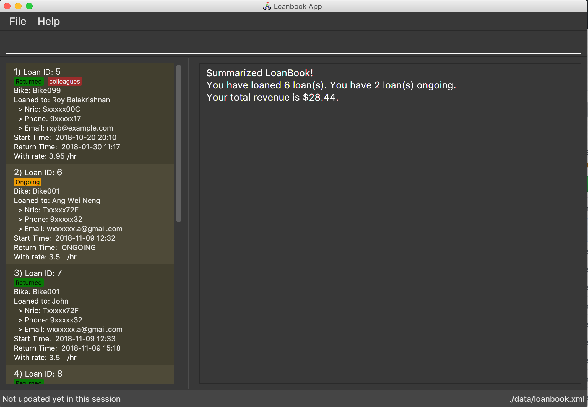

= LoanBook
ifdef::env-github,env-browser[:relfileprefix: docs/]

https://travis-ci.org/CS2103-AY1819S1-F10-2/main[image:https://travis-ci.org/CS2103-AY1819S1-F10-2/main.svg?branch=master[Build Status]]
https://ci.appveyor.com/project/wn96/main/branch/master[image:https://ci.appveyor.com/api/projects/status/wuxod62at21d9xkn/branch/master?svg=true[Build status]]
https://coveralls.io/github/CS2103-AY1819S1-F10-2/main?branch=master[image:https://img.shields.io/coveralls/github/CS2103-AY1819S1-F10-2/main.svg[Coverage Status]]
https://www.codacy.com/app/wn96/main[image:https://img.shields.io/codacy/grade/bf2570da2f954e9c99edce28ff4826df.svg[Codacy Badge]]
https://github.com/CS2103-AY1819S1-F10-2/main/blob/master/LICENSE[image:https://img.shields.io/badge/license-MIT-blue.svg[License]]

ifdef::env-github[]

endif::[]

ifndef::env-github[]
image::images/Ui.png[width="600"]
endif::[]

* This is a desktop Loan Book application. It has a GUI but most of the user interactions happen using a CLI (Command Line Interface).
* The target users are bicycle rental shop owners.

== Site Map

* <<UserGuide#, User Guide>>
* <<DeveloperGuide#, Developer Guide>>
* <<LearningOutcomes#, Learning Outcomes>>
* <<AboutUs#, About Us>>
* <<ContactUs#, Contact Us>>

== Acknowledgements

* The original source of the code is AddressBook - level 4 : https://github.com/se-edu/
* Some parts of this sample application were inspired by the excellent http://code.makery.ch/library/javafx-8-tutorial/[Java FX tutorial] by
_Marco Jakob_.
* Libraries used: https://github.com/TestFX/TestFX[TextFX], https://bitbucket.org/controlsfx/controlsfx/[ControlsFX], https://github.com/FasterXML/jackson[Jackson], https://github.com/google/guava[Guava], https://github.com/junit-team/junit5[JUnit5]

== Licence : link:LICENSE[MIT]
